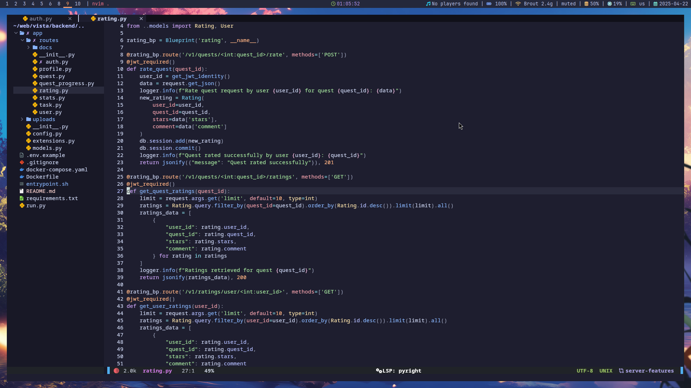

# 🧠 Nvim Config by Hanashiko

Мій персональний Neovim конфіг для Arch Linux з i3wm. Легкий, кастомний та орієнтований на продуктивність — зібраний на базі `lazy.nvim`.

## 🚀 Особливості

- 🌈 Теми: `catppuccin`, `gruvbox`
- 🧠 LSP + Autocompletion: `lspconfig`, `nvim-cmp`, `null-ls`
- 🌲 Файловий менеджер: `nvim-tree`
- 🔍 Пошук: `telescope`
- 🎨 Інтерфейс: `lualine`, `bufferline`, `dashboard`, `colorizer`
- ⚙️ Автоформатування `.php` з `php-cs-fixer`
- 🧪 Treesitter для кращого синтаксису
- 🧩 Безліч корисних плагінів: `todo-comments`, `trouble`, `which-key`, `toggleterm`, `comment`, `vim-illuminate`, `cellular-automaton`, і багато інших
- 🧀 Кастомні модулі для `core`, `plugins`, `keymaps`, `colors`, etc.

## 📁 Структура

```
~/.config/nvim/
├— lua/
│   ├— core/         # базові налаштування, мапінги, автокоманди
│   ├— plugins/      # конфіги плагінів
│   ├— colors/       # теми
│   ├— lsp/          # конфіги LSP
│   └— init.lua      # основний файл
└— init.lua          # точка входу
```

## 🛠️ Встановлення

> Перед встановленням переконайся, що в тебе встановлено `neovim (v0.9+)`, `git`, `ripgrep`, `fd`, `php-cs-fixer` (якщо працюєш з PHP), та `lazy.nvim`.

```bash
git clone https://github.com/Hanashiko/dotfiles-nvim ~/.config/nvim
nvim
```

Neovim сам підтягне `lazy.nvim` і встановить плагіни.

## 💡 Залежності

Рекомендується встановити:

- `ripgrep` – для `telescope`
- `fd` – для кращого пошуку файлів
- `php-cs-fixer` – для форматування PHP
- `lua` – очевидно 😅
- LSP-сервери через `mason.nvim` або `npm`, `pip`, `composer` тощо

## 🧠 Корисні комбінації клавіш

| Клавіша              | Дія                            |
|----------------------|---------------------------------|
| `<Space>ff`          | знайти файл через Telescope    |
| `<Space>e`           | toggle `nvim-tree`             |
| `<Space>/`           | коментування                   |
| `<Space>tt`          | toggle terminal                |
| `<Space>xx`          | Trouble diagnostics            |
| `<Space>bd`          | закрити буфер                  |
| `<Space>l` + ...     | LSP команди                    |
| `<Space>c` + ...     | Color themes                   |

_(весь список в `which-key` при натисканні `<Space>`)_

## 📸 Screenshots



З любов'ю до Arch'а та i3 ❤️

